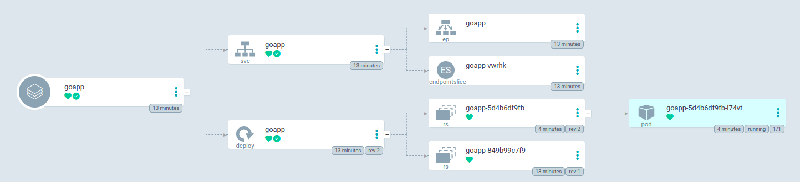
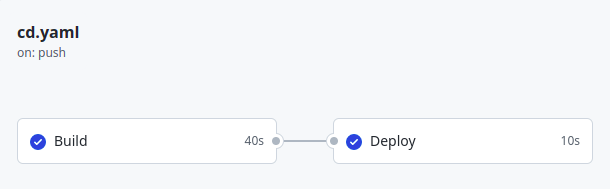

## 💡 Idea
In this process, the idea is to create a new image of Docker of a web server running in Go and automatize the process to build the image and push it to Docker Hub using GitHub Actions and deploy the image automatically in Kubernetes using ArgoCD.

---

### 🛠️ Worked wuth
* Go
* Docker
* K3d
* Kustomize
* GitHub-Actions
* ArgoCD

---

### 🚀 Process

1. Create the artifact using Go.

2. Create the Dockerfile to build the artifact using Go, and after this push your image to DockerHub using the command `docker push <youruser>/image:version`.

3. Create a new folder in your root project with the name `k8s` and inside this folder create 3 files: `deployment.yaml`, `service.yaml`, and `kustomization.yaml`

4.  Install the kustomize in your machine using the command: `sudo snap install kustomize`.

5. Inside the folder `k8s` test the build with Kustomize using the command: `kustomize build`.

6. Create a new repository in GitHub to store your files, and after this return to `DockerHub > Account Settings > Security` > create a new token. Go to your new repository on `GitHub  > Settings > Secrets and variable > actions` > Create new repository secrets: 
- variable: `DOCKER_PASSWORD`
- values: <your_secret_created_DockerHub>

7. Create a new folder in your root project with the name `.github` and inside this folder create a new folder with name `workflow` and inisde the folder worflow create a new file with name `cd.yaml`.

8. Now the process is add all the files in your GitHub project follow the commands:
- `git add . `
- `git commit -m "deploy new version using CD"`
- `git push origin main `

In your GitHub project in the tab Actions, you shoulb be the process to build the new image to Docker Hub.

9. Install the ArgoCD in your Kubernetes using the procedure in [ArgoCD Getting-Started] (https://argo-cd.readthedocs.io/en/stable/getting_started/)

10. Create a new namespace in your Kubernetes with the name goapp using the command `kubectl create namespace goapp`.

11. Run the ArgoCD using the port-forward `kubectl port-forward svc/argocd-server -n argocd 8080:443`

12. Inside the ArgoCD create a new app with the information:
- Application name: `goapp`
- Project name: `Default`
- Sync Policy: `Automatic` (The sync will run automatically every 3 minutes) 
- Source > Repository URL: `https://github.com/jhonthan/goapp-github-actions-argocd`
- PATH: `k8s`
- Cluster URL: `https://kubernetes.default.svc`
- Namespace: `goapp`
- Create

Now the ArgoCD will read your GitHub Repository and deploy the artifacts in your Kubernetes.

